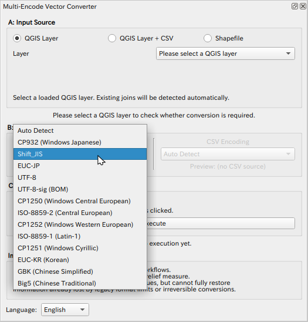

# Multi-Encode Vector Converter

**Multi-Encode Vector Converter** is a QGIS plugin designed to solve character encoding issues (e.g., garbled special characters or accents) when converting vector data, such as Shapefiles, to GeoPackage (GPKG), ensuring safe data integration.

It allows you to preview attribute data before conversion, specify the correct encoding from a wide range of standard Python encodings (e.g., UTF-8, Windows-1252, ISO-8859-1), and output a standard UTF-8 GeoPackage. It also supports joining external CSV files with different encodings during the conversion process.

## Key Features

*   **3 Input Modes:**
    *   **QGIS Layer:** Converts layers currently loaded in QGIS. Detects and preserves existing joins.
    *   **QGIS Layer + CSV:** Joins a layer with an external CSV file and converts the result to GPKG.
    *   **Shapefile:** Converts a file directly without loading it into QGIS first.
*   **Encoding Preview:** Real-time preview of attribute data to verify that text is not garbled under the selected encoding.
*   **Mixed Encoding Support:** Correctly handles scenarios where the vector layer and CSV file use different encodings (e.g., Shapefile in CP932 and CSV in UTF-8).
*   **Field Name Auto-Adjustment:** Automatically renames GPKG reserved keywords (e.g., `fid`, `geom`) and duplicate field names to prevent errors and data loss.

## Usage

1.  **Launch the Plugin:**
    *   Start **Multi-Encode Vector Converter** from the toolbar icon or the Vector menu.
    *   The plugin panel (DockWidget) will appear.

2.  **Select Input Source (A: Input Source):**
    *   **QGIS Layer:** Select a layer from the list.
    *   **QGIS Layer + CSV:** Select a layer and browse for a CSV file. Specify the fields to serve as the Join Key for both.
    *   **Shapefile:** Browse for a `.shp` file directly.

3.  **Check Encoding (B: Encoding):**
    *   Check the **Preview**. If special characters (e.g., accents) are garbled, select the correct encoding from the **Layer Encoding** list (e.g., `Windows-1252` for older Western European data).
    *   If using a CSV, verify the **CSV Encoding** as well.

4.  **Execute (C: Output Format):**
    *   Click the **Execute** button.
    *   Specify the output `.gpkg` file path.
    *   Upon completion, the layer is automatically added to the QGIS project.

## Notes

This plugin assists in migrating to GPKG and normalizing data. It cannot restore information that was already lost in the source data or reverse irreversible conversions.

*(Note: This English description is an automatic translation from the original Japanese.)*

## Requirements

*   QGIS 3.x

## License

GNU General Public License v2.0 or later.

## Author

(C) 2026 by Hideharu Masai

---

**Multi-Encode Vector Converter** es un complemento de QGIS diseñado para resolver problemas de codificación de caracteres (mojibake) al convertir datos vectoriales, como Shapefiles, a GeoPackage (GPKG), garantizando una integración segura de los datos.

Permite previsualizar los datos de atributos antes de la conversión, especificar la codificación correcta de entre una amplia gama de codificaciones estándar de Python (p. ej., UTF-8, ISO-8859-1, Windows-1252) y generar un GeoPackage estándar en UTF-8. También admite la unión de archivos CSV externos con diferentes codificaciones durante el proceso de conversión.

## Características Principales

*   **3 Modos de Entrada:**
    *   **Capa QGIS (QGIS Layer):** Convierte capas cargadas actualmente en QGIS. Detecta y conserva las uniones existentes.
    *   **Capa QGIS + CSV (QGIS Layer + CSV):** Une una capa con un archivo CSV externo y convierte el resultado a GPKG.
    *   **Shapefile:** Convierte un archivo directamente sin cargarlo primero en QGIS.
*   **Vista Previa de Codificación:** Vista previa en tiempo real de los datos de atributos para verificar que el texto no esté ilegible con la codificación seleccionada.
*   **Soporte de Codificación Mixta:** Maneja correctamente escenarios donde la capa vectorial y el archivo CSV utilizan diferentes codificaciones (por ejemplo, Shapefile en CP932 y CSV en UTF-8).
*   **Ajuste Automático de Nombres de Campo:** Renombra automáticamente las palabras clave reservadas de GPKG (por ejemplo, `fid`, `geom`) y los nombres de campo duplicados para evitar errores y pérdida de datos.

## Uso

1.  **Iniciar el Complemento:**
    *   Inicie **Multi-Encode Vector Converter** desde el icono de la barra de herramientas o el menú Vectorial.
    *   Aparecerá el panel del complemento (DockWidget).

2.  **Seleccionar Fuente de Entrada (A: Input Source):**
    *   **QGIS Layer:** Seleccione una capa de la lista.
    *   **QGIS Layer + CSV:** Seleccione una capa y busque un archivo CSV. Especifique los campos que servirán como clave de unión (Join Key) para ambos.
    *   **Shapefile:** Busque un archivo `.shp` directamente.

3.  **Verificar Codificación (B: Encoding):**
    *   Verifique la **Vista Previa (Preview)**. Si los caracteres son ilegibles, seleccione la codificación correcta de la lista **Layer Encoding** (por ejemplo, `CP932` para datos de Windows en japonés).
    *   Verifique la **Vista Previa (Preview)**. Si los caracteres son ilegibles, seleccione la codificación correcta de la lista **Layer Encoding** (por ejemplo, `Windows-1252` o `ISO-8859-1` para datos antiguos de Europa Occidental).
    *   Si utiliza un CSV, verifique también la **Codificación CSV (CSV Encoding)**.

4.  **Ejecutar (C: Output Format):**
    *   Haga clic en el botón **Execute**.
    *   Especifique la ruta del archivo de salida `.gpkg`.
    *   Al finalizar, la capa se añade automáticamente al proyecto QGIS.

## Notas

Este complemento ayuda en la migración a GPKG y la normalización de datos. No puede restaurar información que ya se haya perdido en los datos de origen ni revertir conversiones irreversibles.

*(Nota: Esta descripción en español es una traducción automática del original en japonés.)*

## Requisitos

*   QGIS 3.x

## Licencia

GNU General Public License v2.0 o posterior.

## Autor

(C) 2026 por Hideharu Masai

---

**Multi-Encode Vector Converter** は、シェープファイル（Shapefile）などのベクタデータを GeoPackage (GPKG) に変換する際、文字化け（エンコーディング）の問題を解決し、安全に統合するための QGIS プラグインです。

変換前に属性データのプレビューを行い、Pythonがサポートする多くの標準エンコーディング（Shift_JIS, CP932, UTF-8, EUC-JPなど）から正しいものを指定して、標準的な UTF-8 の GeoPackage に変換・出力します。また、異なるエンコーディングを持つ CSV ファイルを結合して変換することも可能です。

## 主な機能

*   **3つの入力モード:**
    *   **QGIS Layer:** QGIS に読み込み済みのレイヤを変換します。既存の結合（Join）も検出して保持します。
    *   **QGIS Layer + CSV:** レイヤと外部 CSV ファイルを結合して GPKG に変換します。
    *   **Shapefile:** ファイルを直接指定して変換します（QGIS への読み込み不要）。
*   **エンコーディング・プレビュー:** 選択したエンコーディングで文字化けしていないか、属性データをリアルタイムで確認できます。
*   **混在エンコーディング対応:** ベクタレイヤと CSV ファイルで異なるエンコーディング（例: Shapefile は CP932、CSV は UTF-8）が使われていても正しく処理します。
*   **フィールド名の自動調整:** GPKG の予約語（`fid`, `geom` など）や重複するフィールド名を自動的にリネームし、データ損失やエラーを防ぎます。

## 使い方

1.  **プラグインの起動:**
    *   ツールバーのアイコンまたはベクタメニューから **Multi-Encode Vector Converter** を起動します。
    *   パネル（DockWidget）が表示されます。

2.  **入力ソースの選択 (A: Input Source):**
    *   **QGIS Layer:** リストからレイヤを選択します。
    *   **QGIS Layer + CSV:** レイヤを選択し、CSV ファイルを参照します。結合キー（Join key）となるフィールドをそれぞれ指定してください。
    *   **Shapefile:** `.shp` ファイルを直接参照します。

3.  **エンコーディングの確認 (B: Encoding):**
    *   **Preview**（プレビュー）を確認します。文字化けしている場合は、**Layer Encoding** のリストから適切なもの（Windows の日本語データの場合は `CP932` など）を選択してください。
    *   CSV を使用する場合は、**CSV Encoding** も同様に確認します。

4.  **実行 (C: Output Format):**
    *   **Execute** ボタンをクリックします。
    *   保存先の `.gpkg` ファイルを指定します。
    *   変換が完了すると、自動的に QGIS プロジェクトに追加されます。

## 注意事項

本プラグインは、GPKG への移行や正規化を支援するためのツールです。元のデータですでに失われている情報や、不可逆な変換を完全に復元するものではありません。

## 動作環境

*   QGIS 3.x

## ライセンス

GNU General Public License v2.0 or later.

## 作者

(C) 2026 by Hideharu Masai